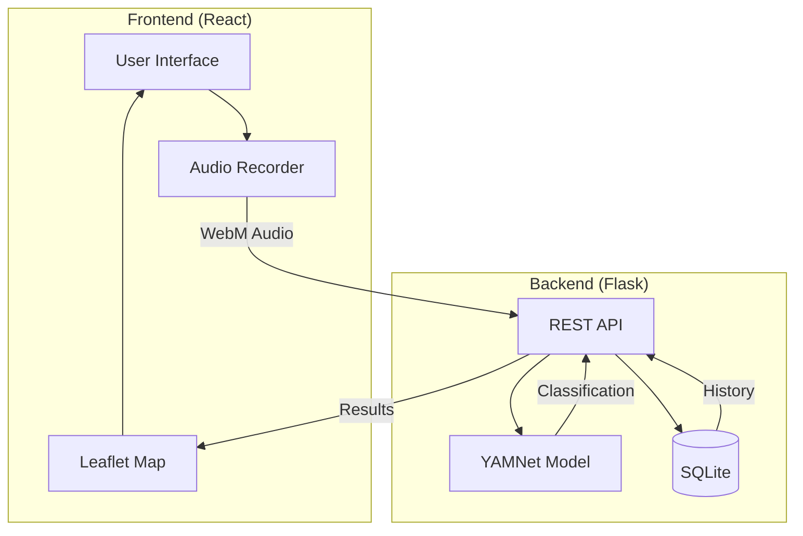
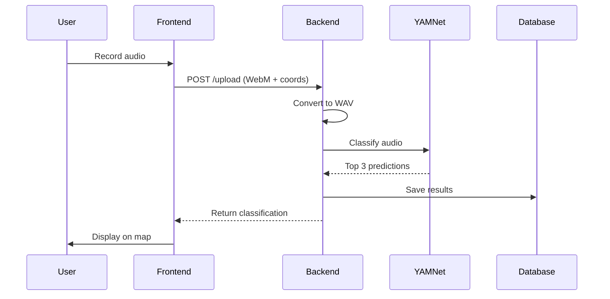

# SONIQUE Architecture

## System Overview

SONIQUE is a full-stack application for urban sound classification and mapping.



## Components

### Frontend
| Component | Technology | Purpose |
|-----------|------------|---------|
| UI Framework | React 18 + TypeScript | Component-based UI |
| Build Tool | Vite | Fast HMR & bundling |
| Styling | Tailwind CSS + shadcn/ui | Modern design system |
| Maps | Leaflet + react-leaflet | Geospatial visualization |
| Audio | Web Audio API | Browser recording |

### Backend
| Component | Technology | Purpose |
|-----------|------------|---------|
| API Framework | Flask | REST endpoints |
| ML Model | YAMNet (TensorFlow Hub) | Audio classification |
| Audio Processing | librosa + ffmpeg | Audio conversion |
| Database | SQLite | Sound history storage |

## Data Flow



## Folder Structure

```
SONIQUE/
├── client/                 # React frontend
│   ├── src/
│   │   ├── components/    # UI components
│   │   ├── pages/         # Route pages
│   │   └── hooks/         # Custom hooks
│   ├── Dockerfile         # Frontend container
│   └── package.json
├── server/                 # Flask backend
│   ├── app.py             # Main application
│   ├── Dockerfile         # Backend container
│   └── requirements.txt
├── docs/                   # Documentation
└── docker-compose.yml     # Orchestration
```

## API Endpoints

| Method | Endpoint | Description |
|--------|----------|-------------|
| GET | `/health` | Health check |
| POST | `/upload` | Upload audio for classification |
| GET | `/history` | Get all sound history |
