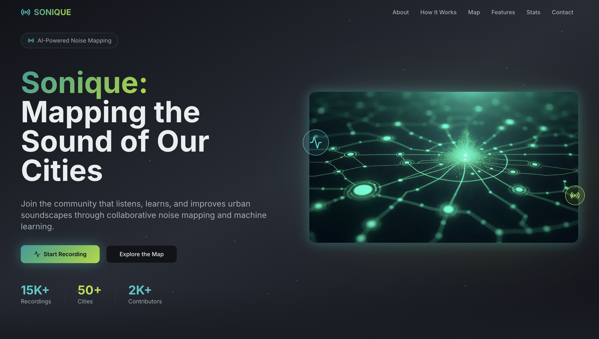
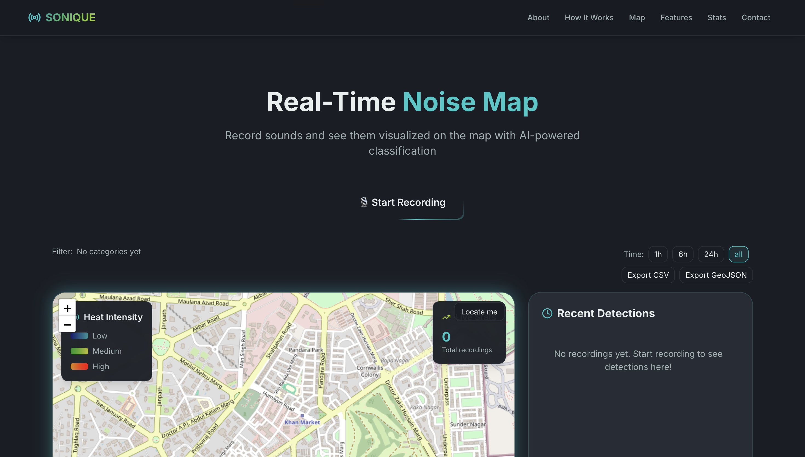
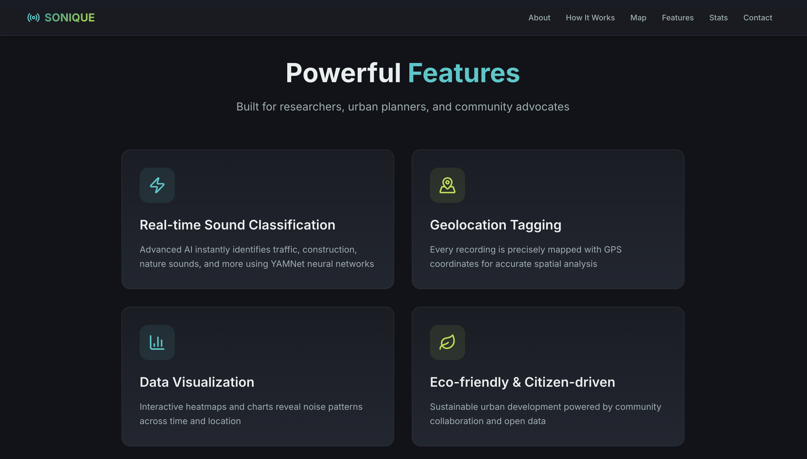
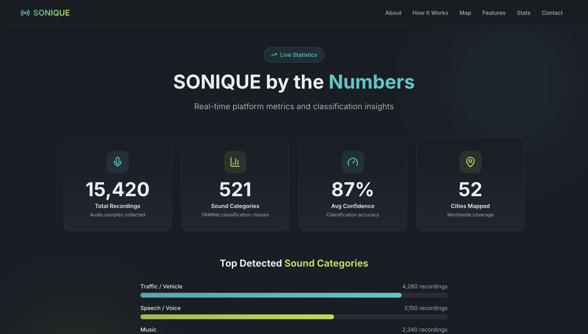
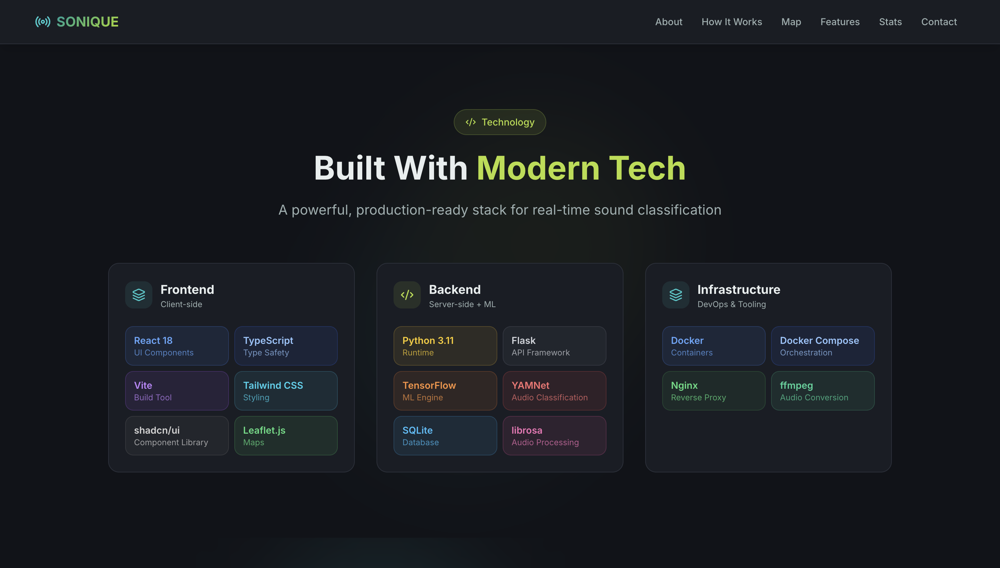
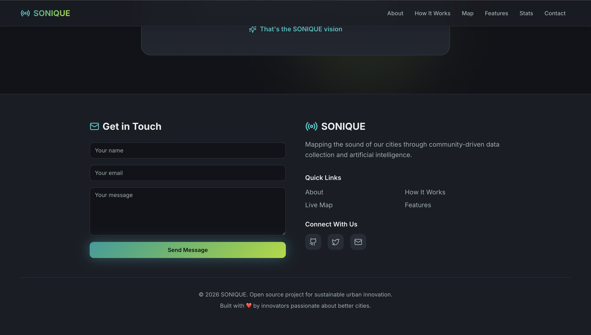

# SONIQUE — Software Design Document

> **Project**: SONIQUE – Urban Sound Classification System  
> **Author**: Shresth Kumar Gupta  
> **GitHub**: [github.com/Srazyy/SONIQUE](https://github.com/Srazyy/SONIQUE)  
> **Date**: March 2026

---

## Table of Contents

1. [Introduction](#1-introduction)
2. [Design Principles Applied](#2-design-principles-applied)
3. [High-Level Architecture](#3-high-level-architecture)
4. [User Interface Design](#4-user-interface-design)
5. [Design Decisions & Why](#5-design-decisions--why)
6. [Data Design](#6-data-design)
7. [Conclusion](#7-conclusion)

---

## 1. Introduction

SONIQUE is a full-stack web application that uses machine learning to classify urban sounds in real-time. Users record audio through their browser, which is sent to a Flask backend running Google's YAMNet model (521 sound classes). Results are displayed on an interactive Leaflet map with geolocation data, enabling communities to visualize and understand urban soundscapes.

### Tech Stack Summary

| Layer | Technology |
|-------|-----------|
| Frontend | React 18, TypeScript, Vite, Tailwind CSS, shadcn/ui |
| Backend | Python 3.11, Flask, TensorFlow, YAMNet |
| Database | SQLite |
| Maps | Leaflet.js, OpenStreetMap, leaflet.heat |
| Containerization | Docker, Docker Compose |

---

## 2. Design Principles Applied

### 2.1 Abstraction

Abstraction is used to hide complex implementation details behind clean interfaces throughout the application:

| Abstraction | What's Hidden | What's Exposed |
|-------------|---------------|----------------|
| **Recorder component** | Web Audio API, MediaRecorder, waveform canvas rendering, blob creation | Single "Record" button with visual feedback |
| **LiveMap component** | Leaflet initialization, tile loading, marker management, heatmap layer toggling, coordinate handling | Interactive map with automatic marker placement |
| **`/upload` endpoint** | FFmpeg conversion (WebM→WAV), librosa loading, YAMNet tensor operations, numpy score aggregation | Simple REST endpoint: send audio file, receive JSON classification |
| **Database functions** | SQL queries, connection pooling, cursor management, row-to-dict conversion | Three clean functions: `init_db()`, `save_to_db()`, `fetch_history()` |
| **Docker Compose** | Container networking, port mapping, volume mounts, build contexts, Nginx reverse proxy | Single `docker-compose up --build` command to run everything |

**Why this matters**: New team members can work on the Recorder component without understanding how Leaflet markers work, and vice versa. The backend's ML complexity is completely invisible to the frontend.

### 2.2 Modularity

The application is decomposed into independent, self-contained modules:

**Frontend Modules** (each a separate `.tsx` file):

```
src/
├── pages/          → Route-level containers (Index, NotFound)
├── components/     → Feature modules
│   ├── Navbar.tsx          → Sticky navigation bar
│   ├── Hero.tsx            → Landing section
│   ├── Recorder.tsx        → Audio capture + upload
│   ├── LiveMap.tsx         → Map visualization + markers + heatmap
│   ├── Features.tsx        → Feature showcase
│   ├── Statistics.tsx      → Animated metrics dashboard
│   ├── About.tsx           → Project description
│   ├── HowItWorks.tsx      → User guide
│   ├── Team.tsx            → Team info
│   ├── TechStack.tsx       → Technology stack showcase
│   ├── FutureVision.tsx    → Roadmap
│   ├── Footer.tsx          → Footer navigation + contact form
│   └── ui/                 → Reusable UI primitives (shadcn/ui)
└── hooks/          → Shared logic
    ├── use-mobile.tsx      → Responsive breakpoint detection
    └── use-toast.ts        → Notification management
```

**Backend Modules** (organized sections within `app.py`):

| Module | Responsibility | Functions |
|--------|---------------|-----------|
| Flask Setup | Server config, CORS | `app`, `CORS()` |
| Database | Data persistence | `init_db()`, `save_to_db()`, `fetch_history()` |
| YAMNet Setup | ML model loading | `class_names_from_csv()`, model initialization |
| Audio Utils | Format conversion | `convert_to_wav()`, `classify_audio()` |
| Routes | API endpoints | `/health`, `/upload`, `/history` |

**Why this matters**: Each module can be developed, tested, and debugged independently. Adding a new page (e.g., analytics dashboard) requires only adding a new component and route — no changes to existing modules.

### 2.3 High Cohesion

Each module has a single, well-defined responsibility:

- **`Recorder.tsx`**: *Only* handles audio recording — microphone access, waveform visualization, recording state, and sending audio data to the API. It does not render maps or manage history.
- **`LiveMap.tsx`**: *Only* handles geospatial visualization — map rendering, marker placement, heatmap layers, popup details. It does not capture audio.
- **`save_to_db()`**: *Only* inserts classification results into SQLite. It does not classify audio or convert formats.
- **`classify_audio()`**: *Only* runs YAMNet inference on a WAV file. It does not save results or handle HTTP requests.

This follows the **Single Responsibility Principle** — if the classification algorithm changes, only `classify_audio()` is modified; if the map library changes, only `LiveMap.tsx` is affected.

### 2.4 Low Coupling

Components interact through minimal, well-defined interfaces:

```
┌─────────────┐     HTTP/JSON      ┌──────────────┐
│  React App  │ ←────────────────→ │  Flask API   │
│  (client/)  │   Only 3 endpoints │  (server/)   │
└─────────────┘                    └──────────────┘
     │                                    │
     │ Props & Events                     │ Function calls
     ▼                                    ▼
┌──────────┐  ┌──────────┐      ┌──────────┐  ┌──────────┐
│ Recorder │  │ LiveMap  │      │  YAMNet  │  │ Database │
│          │  │          │      │          │  │          │
└──────────┘  └──────────┘      └──────────┘  └──────────┘
 No shared state between          No direct dependency
 components                       between modules
```

**Key coupling decisions**:
1. **Frontend ↔ Backend**: Connected *only* through 3 REST endpoints (`/health`, `/upload`, `/history`). The frontend could be rewritten in Vue or Angular without touching the backend.
2. **Components ↔ Components**: React components share no direct state. `Recorder` doesn't import or reference `LiveMap`. Data flows through the API.
3. **YAMNet ↔ Database**: The ML module and database module have zero direct dependencies. The route handler (`/upload`) orchestrates them, acting as a mediator.
4. **UI primitives**: shadcn/ui components are generic, reusable building blocks with no knowledge of the domain logic.

---

## 3. High-Level Architecture

### 3.1 Architecture Style: Layered + Client-Server

SONIQUE follows a **Layered Architecture** combined with a **Client-Server** deployment model.

**Why Layered + Client-Server?**

| Reason | Explanation |
|--------|-------------|
| **Separation of concerns** | Each layer has a clear role — UI, logic, data access — making the codebase navigable |
| **Independent deployment** | Client and server run in separate Docker containers with different runtimes (Node.js vs Python) |
| **Technology flexibility** | Frontend uses React/TypeScript; backend uses Python/TensorFlow — each layer uses the best tool for its job |
| **Testability** | Layers can be tested in isolation (unit test DB functions without starting Flask; test components without a backend) |
| **Scalability path** | Server can be scaled independently; heavy ML processing doesn't block UI rendering |

### 3.2 Architecture Diagram

The diagram below shows the 5 layers of the system:


*Open `sonique_layered_architecture.drawio` in diagrams.net for the editable version.*

**Layer Breakdown**:

| # | Layer | Location | Key Components |
|---|-------|----------|----------------|
| 1 | **Presentation** | `client/src/components/` | Hero, Recorder, LiveMap, Features, About, Footer + shadcn/ui + Tailwind |
| 2 | **Application Logic** | `client/src/hooks/`, App.tsx | React Query (server state), custom hooks (use-mobile, use-toast), routing |
| 3 | **API / Routing** | `server/app.py` (routes) | Flask endpoints: `GET /health`, `POST /upload`, `GET /history`, CORS middleware |
| 4 | **Business Logic** | `server/app.py` (utils) | `convert_to_wav()` (FFmpeg), `classify_audio()` (YAMNet/TensorFlow), `parse_float()` |
| 5 | **Data Access** | `server/app.py` (database) | `init_db()`, `save_to_db()`, `fetch_history()` → SQLite `sounds.db` |

### 3.3 Component Interaction Diagram


*Open `sonique_component_diagram.drawio` in diagrams.net for the editable version.*

### 3.4 Data Flow (Sequence)

```
User clicks "Record"
    │
    ▼
Recorder.tsx captures audio via Web Audio API
    │ Creates WebM blob + gets GPS coordinates
    ▼
API Client sends POST /upload (multipart: audio + lat + lng)
    │
    ▼
Flask route receives request
    │
    ├──→ convert_to_wav(): FFmpeg converts WebM → WAV (16kHz, mono)
    │
    ├──→ classify_audio(): librosa loads WAV → YAMNet infers → Top 3 results
    │
    ├──→ save_to_db(): INSERT results into SQLite
    │
    └──→ Return JSON { results, lat, lng }
    │
    ▼
LiveMap.tsx receives results → places marker on Leaflet map
    │ Shows popup with sound label + confidence score
    ▼
User sees classified sound on interactive map
```

---

## 4. User Interface Design

### 4.1 Screen Overview

The application consists of 6 primary screens/sections, all accessible on a single-page layout with a sticky navigation bar:

| # | Screen | Purpose | Key Elements |
|---|--------|---------|--------------|
| 1 | **Home / Hero** | Landing page, first impression | Sticky navbar, animated title, CTA buttons, stat counters, background gradient |
| 2 | **Noise Map + Recorder** | Audio capture & spatial visualization | Record button, Leaflet map, heatmap overlay, time filters, export options |
| 3 | **Features** | Feature showcase | 4 feature cards: AI Classification, Geolocation, Data Viz, Citizen-driven |
| 4 | **Statistics Dashboard** | Platform metrics & insights | Animated counter cards, top sound categories bar chart |
| 5 | **Tech Stack** | Technology showcase | Frontend/Backend/Infrastructure cards with color-coded tech badges |
| 6 | **Footer / Contact** | Contact form & links | Contact form, social links, quick navigation, copyright |

### 4.2 Application Screenshots

Below are screenshots of the live running application:

#### Screen 1: Home Page


#### Screen 2: Noise Map + Recorder


#### Screen 3: Features


#### Screen 4: Statistics Dashboard


#### Screen 5: Tech Stack


#### Screen 6: Footer / Contact


### 4.3 UI Design Rationale

| Design Choice | Implementation | Why |
|--------------|----------------|-----|
| **Dark theme** | Tailwind dark palette + shadcn/ui dark mode components | Reduces eye strain for extended use; professional appearance; better contrast for map visualization |
| **Sticky glassmorphism navbar** | `backdrop-blur-xl`, scroll-aware background opacity, mobile hamburger menu | Persistent navigation improves user orientation; glassmorphism adds modern polish; mobile menu ensures touch accessibility |
| **Component library (shadcn/ui)** | Buttons, cards, toasts, tooltips all from shadcn/ui | Ensures visual consistency across all screens; accessible by default (ARIA attributes); rapid development |
| **Responsive design** | Tailwind breakpoints (`sm`, `md`, `lg`) + `use-mobile` hook | Field researchers use the app on mobile phones; map must be touch-friendly |
| **Animated counters** | IntersectionObserver + `requestAnimationFrame` with ease-out cubic | Statistics section engages users with scroll-triggered animations; counters provide instant credibility |
| **Visual feedback** | Real-time waveform during recording; toast notifications for errors; loading states during API calls | Users need immediate confirmation that recording is active and processing is happening |
| **Single-page layout** | All sections rendered on one scrollable page via `Index.tsx` with smooth-scroll navigation | Smoother UX; no page reload delays; all features accessible without navigation confusion |
| **Leaflet over Google Maps** | Open-source, no API key required, free tiles from OpenStreetMap | No cost barrier; works offline with cached tiles; customizable markers and heatmap overlay |

---

## 5. Design Decisions & Why

### Decision 1: Separated Audio Processing into Dedicated Functions
- **What**: `convert_to_wav()` and `classify_audio()` are standalone functions, not embedded in the route handler.
- **Why**: **Low coupling** — audio conversion logic is independent of classification logic. If we switch from FFmpeg to another converter, only one function changes. Each function can be unit-tested in isolation.
- **Impact**: Easier debugging (a conversion error vs. classification error has a clear source), and functions are reusable for batch processing in the future.

### Decision 2: REST API as the Only Integration Point
- **What**: Frontend and backend communicate exclusively through 3 REST endpoints (`/health`, `/upload`, `/history`). No shared code, no shared database access.
- **Why**: **Low coupling** — complete technology independence. The React frontend could be swapped for a mobile app (React Native, Flutter) or a CLI tool without changing a single line of backend code.
- **Impact**: Enables independent deployment via Docker (separate containers), independent scaling, and team members can work on frontend/backend simultaneously without conflicts.

### Decision 3: SQLite over PostgreSQL for Data Storage
- **What**: Used SQLite (file-based) instead of PostgreSQL or MongoDB.
- **Why**: **Simplicity and modularity** — SQLite requires zero setup, no separate server process, and the entire database is a single `sounds.db` file. For the MVP scope (local-first, single-user), it provides sufficient performance with minimal complexity.
- **Impact**: Docker volume mount handles persistence (`./server/sounds.db:/app/sounds.db`). Future migration to PostgreSQL requires changing only the 3 database functions — the rest of the application is unaffected (low coupling).

### Decision 4: Dockerized Client and Server Separately
- **What**: Client and server have independent Dockerfiles and are orchestrated via `docker-compose.yml`. Frontend runs Nginx; backend runs Python/Flask.
- **Why**: **Modularity** — each service has different runtime requirements (Node.js/Nginx vs. Python/TensorFlow). Separate containers allow independent rebuilds, updates, and resource allocation.
- **Impact**: `docker-compose up --build` gives a reproducible, consistent environment. The Nginx container serves static assets efficiently while the backend handles CPU-intensive ML tasks.

### Decision 5: React Query for Server State Management
- **What**: Used `@tanstack/react-query` instead of manual `useState` + `useEffect` patterns for API data.
- **Why**: **Abstraction and cohesion** — React Query abstracts caching, background refetching, error handling, and loading states into a declarative API. Components remain focused on rendering (high cohesion) rather than managing fetch logic.
- **Impact**: No prop drilling of loading/error states through component trees. Multiple components can access the same cached data without redundant API calls.

---

## 6. Data Design

### Entity Relationship Diagram

The database uses a single-table design for the MVP, with the `sounds` table storing all classification results:

```
┌─────────────────────────────────┐
│           sounds                │
├─────────────────────────────────┤
│ PK  id          INTEGER        │
│     lat         REAL           │
│     lng         REAL           │
│     label       TEXT           │
│     confidence  REAL           │
│     timestamp   DATETIME       │
└─────────────────────────────────┘
```

*See `docs/sonique_erd.drawio` for the expanded ERD with future entities (Location, SoundClass, SoundRecording, AudioAnalysis).*

**Why a single table?** For the MVP, all data dimensions (location, classification, time) are tightly related to each recording event. Normalizing into separate tables would add join complexity without practical benefit at this scale. The ERD shows a future-ready normalized design for when the system needs to support multiple users, analytics, and data export.

---

## 7. Conclusion

SONIQUE's design prioritizes **maintainability** and **future extensibility** through consistent application of core design principles:

- **Abstraction** hides complexity at every layer — from the Web Audio API to TensorFlow inference
- **Modularity** ensures each feature is a self-contained unit that can be modified independently
- **High cohesion** keeps each module focused on one responsibility
- **Low coupling** connects modules through minimal, well-defined interfaces (REST API, function parameters)

These principles make it straightforward to:
- Add new features (e.g., user authentication, analytics dashboard) without breaking existing functionality
- Swap technologies (e.g., PostgreSQL for SQLite, Vue for React) with minimal impact
- Scale the system (e.g., separate the ML model into a microservice)

The layered architecture and client-server deployment model provide a solid foundation for evolving SONIQUE from an MVP into a production-ready platform.

---

> *Document prepared for Digital Assignment 2 — Software Engineering*  
> *Shresth Kumar Gupta | srazyy7@gmail.com | GitHub: @Srazyy*
